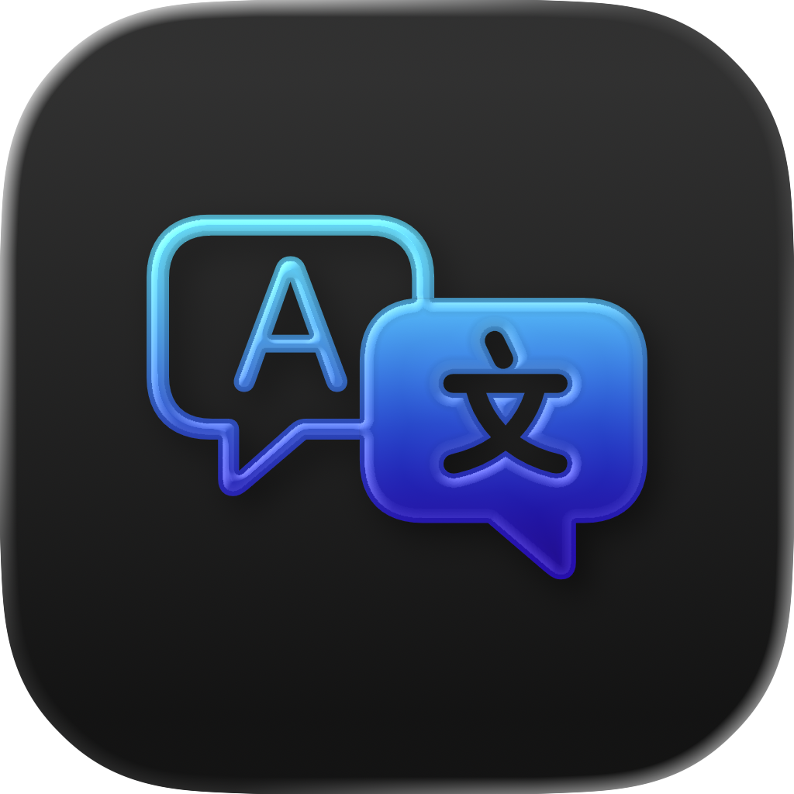
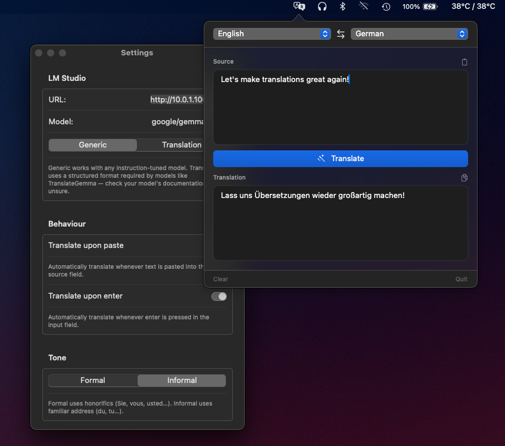

<div align="center">
  

  # LangBox

  A tiny macOS menu bar app that translates text using your own local LLM.

  
  
  
</div>

<br>

<div align="center">
  
</div>

## What it is

LangBox lives in your menu bar. Click the icon, type or paste some text, pick a
source and target language, and get a translation back — all without the text
ever leaving your machine. There's no cloud API, no account, and no telemetry:
LangBox talks directly to a model you're already running locally through
[LM Studio](https://lmstudio.ai).

## Features

- **Menu bar popover** — one click to translate, no dock icon, no clutter.
- **Bring your own model** — point LangBox at any local [LM Studio](https://lmstudio.ai) server.
- **Two prompting modes**
  - *Generic* — works with any instruction-tuned chat model via `/v1/chat/completions`.
  - *Translation* — a structured prompt for translation-tuned models such as `google/gemma-3-12b`, sent to `/v1/completions`.
- **Tone control** — Formal or Informal register (honorifics like *Sie*, *vous*, *usted* vs. casual *du*, *tu*).
- **14 languages** — English, Czech, Slovak, Spanish, French, German, Italian, Portuguese, Polish, Russian, Japanese, Chinese, Korean, Arabic.
- **Quality-of-life shortcuts** — swap languages, translate on paste, translate on <kbd>Return</kbd>, ⌘-Return to translate, one-click copy/paste.
- **Sandboxed** — App Sandbox enabled, with only outbound network access to your LM Studio host.

## Requirements

- macOS 15.7 or later
- [LM Studio](https://lmstudio.ai) (or a compatible OpenAI-style server) running locally with a model loaded

## Getting started

1. Start LM Studio and load a model, then start its local server.
2. Launch LangBox — it appears as an icon in the menu bar.
3. Right-click the icon → **Settings…** and set:
   - **URL** — your LM Studio server address (e.g. `http://localhost:1234`)
   - **Model** — the model identifier as reported by LM Studio
   - **Generic** vs **Translation** mode, depending on your model
   - **Tone** — Formal or Informal
4. Left-click the menu bar icon, type or paste text, and hit **Translate**.

## Building from source

Open `LangBox/LangBox.xcodeproj` in Xcode and run the `LangBox` scheme, or build from the command line:

```bash
xcodebuild -project LangBox/LangBox.xcodeproj -scheme LangBox -configuration Debug build
```

## Tech stack

- **SwiftUI** for the popover and settings UI, hosted from an **AppKit** status bar item (`NSStatusItem` / `NSPopover`)
- Plain `URLSession` calls to an OpenAI-compatible LM Studio endpoint — no third-party dependencies
